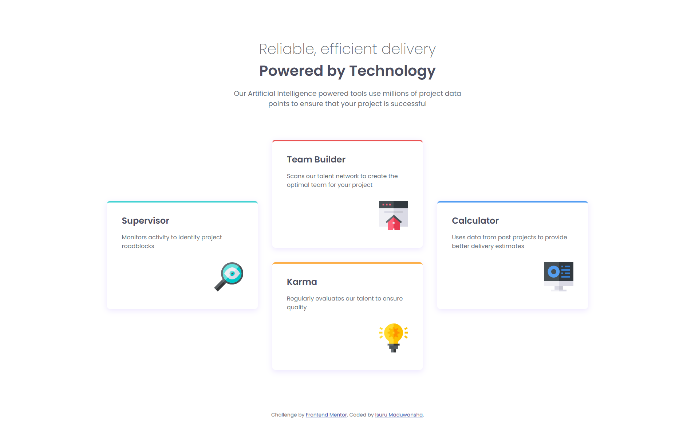

# Frontend Mentor - Four card feature section solution

This is a solution to the [Four card feature section challenge on Frontend Mentor](https://www.frontendmentor.io/challenges/four-card-feature-section-weK1eFYK). Frontend Mentor challenges help you improve your coding skills by building realistic projects. 

## Overview

### The challenge

Users should be able to:

- View the optimal layout for the site depending on their device's screen size

### Screenshot

### Links

- Solution URL: [Solution URL here](https://github.com/Isuru-Maduwansha/four-card-feature-sectoin)
- Live Site URL: [Live site URL here](https://isuru-maduwansha-four-card.netlify.app/)

## My process

### Built with

- Semantic HTML5 markup
- CSS custom properties
- Flexbox
- CSS Grid
- Mobile-first workflow

### What I learned

Learn About CSS Grid and Grid Items. CSS Grid allows you to create complex, responsive web designs with ease. It provides a two-dimensional grid-based layout system, enabling you to control both rows and columns simultaneously.

## Author

- Frontend Mentor - [@Isuru Maduwansha](https://www.frontendmentor.io/profile/Isuru-Maduwansha)
